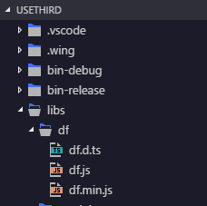
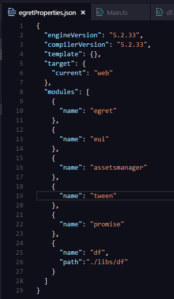
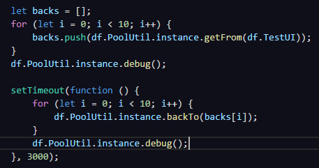
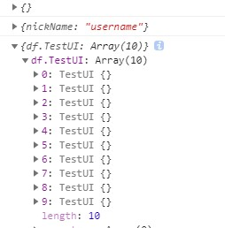

# df egret 第三方库
### 特点  
1. ts语言，完善的代码提示.
2. 不引入第三方组件，独立使用无依赖.
3. 符合egret官方标准，接入简单.
4. 独立命名空间，避免命名冲突.  

### 功能  
1. 提供常用游戏工具类，如对象池
2. ...

### 接入流程
1. 打开egret项目在libs文件夹下新建df文件夹，放入**df.d.ts**, **df.ts**, **df.min.js**文件  


2. 打开egretProperties.json添加df,如下图配置  


### 使用示例
1. 代码示例   

2. 打印输出  


### API  
[--->>>api doc<<<---](modules/df.html)  
所有api皆在df命名空间下，见下面调用示例：

*类*  
`Pool`  单例方法  
调用示例   
`df.Pool.instance.debug()`  
*属性*  
`无`  
*方法*  
```
        /**
         * 拿取对象
         * @param cls 类名，非实例
         */
        getFrom(cls: any): any;

        /**
         * 归还对象
         * @param instance 实例，非类名
         */
        backTo(instance: any): void;

        /**
         * 清空整个对象池
         */
        clear(): void;

        /**
         * 测试，对象池打印
         */
        debug(): void;

